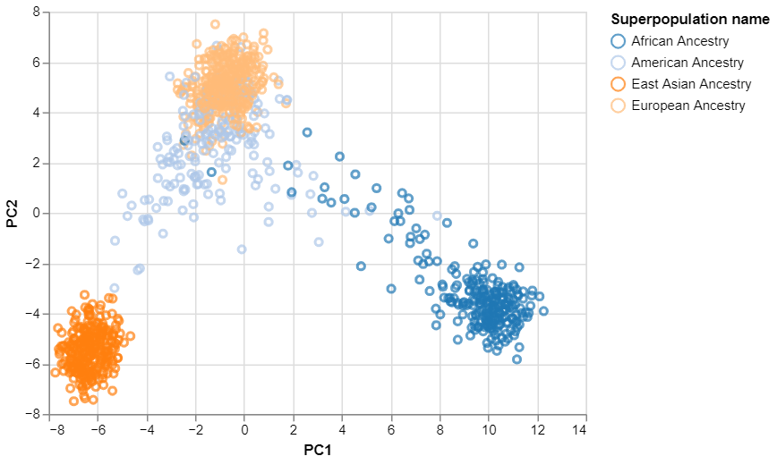

# Using Principal Component Analysis (PCA) to understand human genetic variation based on data from the International Genome Sample Resource (IGSR)  
This project reads in human genetic data from the [IGSR](https://www.internationalgenome.org/home) in VCF format and performs PCA using scikit-learn and plots the results using altair, providing insights on **human genetic variation** based on **geographic location**


To download the data, run:
```download.sh```

Then parse the data:
```vcf_to_matrix```

Then finally run the python notebook
```plot_pca.ipynb```

Results for Chromosome 22:


